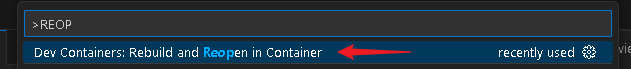

## PROCESSO SELETIVO SEPLAG 2025

### VAGA: FRONTEND SENIOR

### DADOS DO PARTICIPANTE:

Nome: Álvaro Claro dos Anjos  
CPF: 047.179.541-06  
Vaga: Frontend Senior

### Informações do Projeto

Frameworks e libs utilizadas:

- Angular v19
- Angular Material v19
- Tailwind v4

## Como rodar o projeto (Com Docker Compose)

### Requisitos:

- Docker
- Docker Compose

### Passos

- Na raiz do projeto, rode o comando `docker compose up -d`

Isso fará com que o projeto seja buildado e levantado no endereço http://localhost:8080

## Como debugar o projeto

### Versão que roda direto no computador

- Tenha instalado o Node na versão 22
- Rode o comando `npm i` na raiz do projeto para baixar todos as dependências
- Após terminar de rodar, aperte F5 no seu teclado para inicar o projeto.

### Versão que roda em DevContainer

DevContainer é deixar rodar todo o ambiente de desenvolvimento em um container docker sem precisar instalar Node ou outras dependencias.

#### Requisitos

- Docker instalado
- Extensão [DevContainer](https://marketplace.visualstudio.com/items?itemName=ms-vscode-remote.remote-containers) no VSCode

#### Como rodar

Com o docker e extensão instalados

- No seu VSCode, aperte as seguintes teclas: CTRL+SHIFT+P
- Procure pela opção 'Dev Containers: Rebuild and Reopen in Container'
  
- Aguarde o VSCode criar o container (Demora uns 5 minutos)
- Com o container carregado, rode o comando `npm i` para instalar as dependências do projeto
- Após terminar de instalar as depêndencias, Aperte F5 para iniciar o projeto.

# Imagens do projeto rodando

## Desktop

### Homepage:

- 

- 

### Detalhes do Desaparecido:

- 

### Envio de informações

- 

## Mobile (Responsivo)

