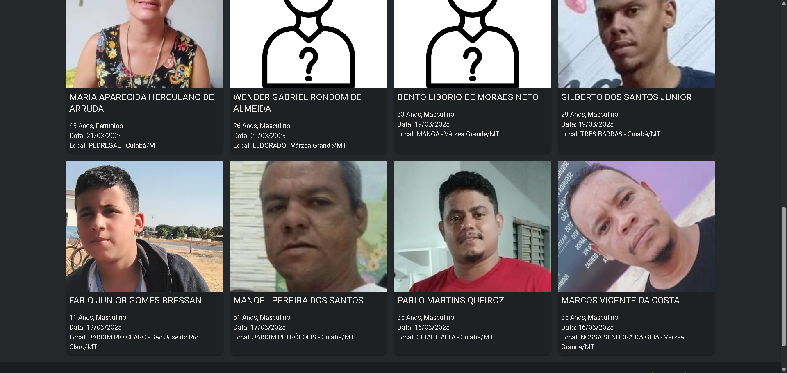
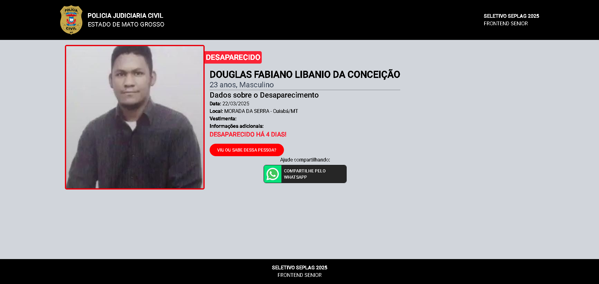
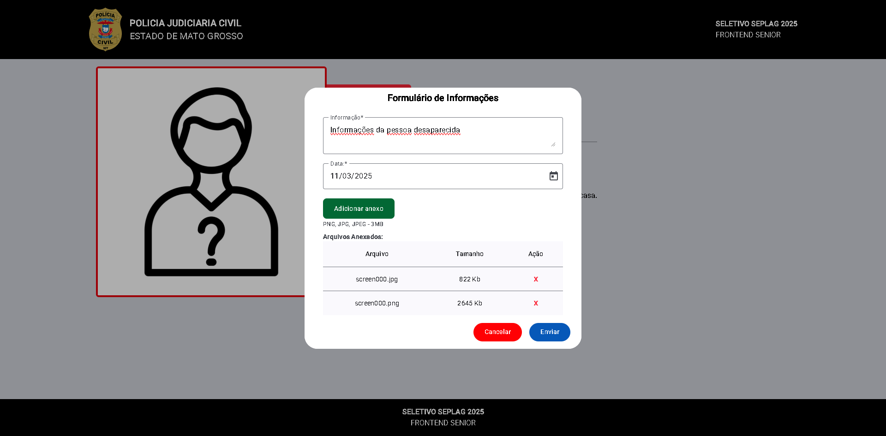
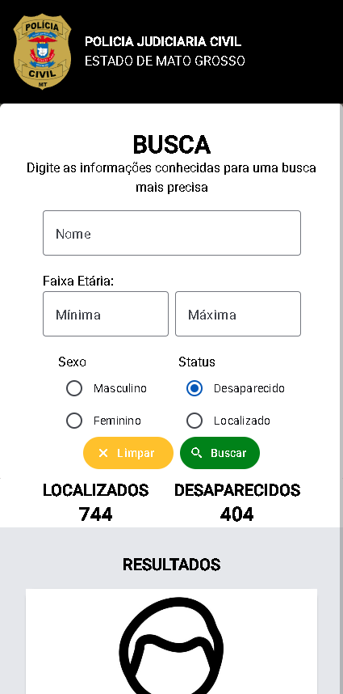
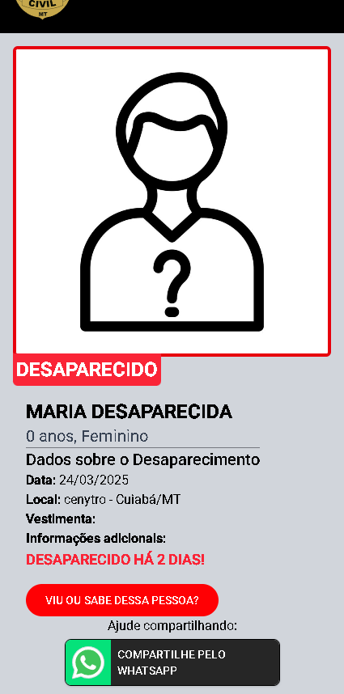
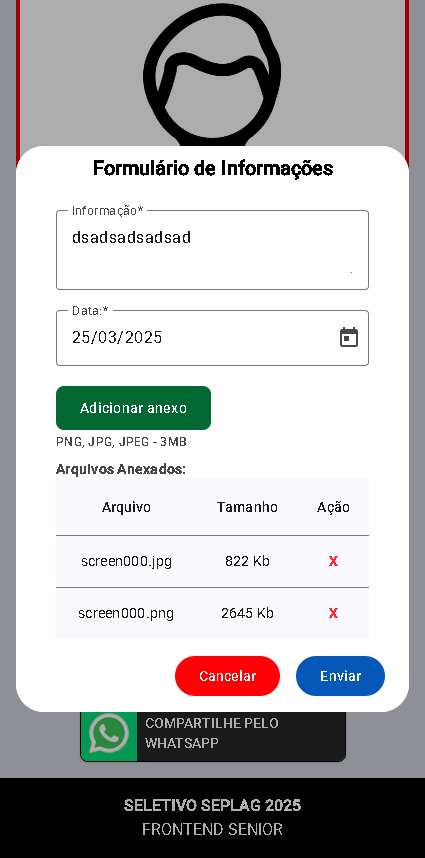

## PROCESSO SELETIVO SEPLAG 2025

- [Dados do Participante](#dados-do-participante)
- [Informações do Projeto](#informações-do-projeto)
- [Live Demo](#live-demo)
- [Executando a Aplicação](#executando-a-aplicação)
  - [Com Node.js](#com-nodejs)
  - [Com Docker-Compose](#com-docker-compose)
  - [Com Docker sem Docker Compose](#com-docker-sem-docker-compose)
- [Imagens do Projeto](#imagens-do-projeto-rodando)

### VAGA: FRONTEND SENIOR

### DADOS DO PARTICIPANTE:

Nome: Álvaro Claro dos Anjos  
Telefone: (66) 9 9982-7576
Email: alvarocda@gmail.com
Vaga: Frontend Senior

### Informações do Projeto

Frameworks e libs utilizadas:

- Angular v19
- Angular Material v19
- Tailwind v4
- Ngx Toastr

### Live Demo

Uma versão de demonstração desse projeto esta disponivel no endereço https://alvarocda.github.io/seletivo_seplag_2025_frontend_senior/

## Executando a Aplicação

### Com Node.js

- Tenha instalado o Node na versão 22
- Rode o comando `npm i` na raiz do projeto para baixar todos as dependências
- Após terminar de rodar, aperte F5 no seu teclado para inicar o projeto.

### Com Docker Compose

#### Requisitos:

- Docker
- Docker Compose

#### Passos

- Na raiz do projeto, rode o comando

```shell
docker compose up -d
```

Isso fará com que o projeto seja buildado e levantado no endereço http://localhost:8095

### Com Docker (Sem docker compose)

Em um terminal, rode o seguinte comando:

```shell
docker run -d -t -p 8095:80 alvarocda/seletivo2025
```

Espere o container levantar e então em um browser acessa a url http://localhost:8080

# Imagens do projeto rodando

## Desktop

### Homepage:

- 

- 

### Detalhes do Desaparecido:

- 

### Envio de informações

- 

## Mobile (Responsivo)






